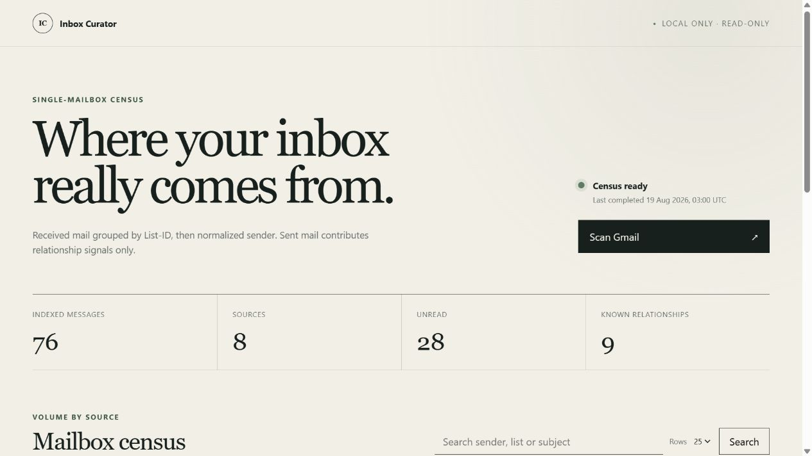

# InboxCurator

InboxCurator is a local, read-only Gmail census. It scans one mailbox, groups received messages by `List-ID` (falling back to normalized sender), and shows which sources account for mailbox volume. A separate Sent scan identifies addresses and threads the user has interacted with.

The application is an ASP.NET Core Razor Pages app targeting .NET 10. It binds only to `127.0.0.1`, stores metadata in SQLite, and never persists email bodies, HTML, attachment content, or OAuth tokens in the database.



## Safety boundary

- OAuth requests exactly `https://www.googleapis.com/auth/gmail.readonly`.
- There is no `gmail.modify`, compose, send, draft, delete, trash, archive, or label code path.
- Census query: `-in:trash -in:spam -in:drafts -in:sent` with `includeSpamTrash=false`.
- Relationship query: `in:sent -in:trash -in:spam -in:drafts`.
- Each message is fetched as metadata with selected headers first.
- Attachment detection uses a subsequent partial response containing MIME filenames and attachment IDs only. Body data is excluded, and the attachment endpoint is never called.
- Logs contain scan state, counts, retry timing, and sanitized failure codes—not OAuth tokens, headers, addresses, subjects, or body content.
- The project makes no LLM, MCP, OpenClaw, or other AI call. The adversarial email fixture is inert test corpus for future work.

See [ADR 0001](docs/adr/0001-read-only-privacy-boundary.md) for the enforced privacy boundary.

## Prerequisites

- [.NET 10 SDK](https://dotnet.microsoft.com/download/dotnet/10.0)
- A Google account with a Gmail mailbox
- A Google Cloud project with an OAuth Desktop app client

## Google Cloud and OAuth setup

1. Open the [Google Cloud Console](https://console.cloud.google.com/) and create or select a project.
2. In **APIs & Services → Library**, enable the [Gmail API](https://console.cloud.google.com/apis/library/gmail.googleapis.com).
3. Configure the [OAuth consent screen](https://console.cloud.google.com/auth/overview). For an External app in testing, add the mailbox account as a test user.
4. Under **Data Access**, add only the restricted scope `https://www.googleapis.com/auth/gmail.readonly`. Do not add `gmail.modify`, `mail.google.com`, compose, send, labels, or settings scopes. Google documents the available scopes in [Choose Gmail API scopes](https://developers.google.com/workspace/gmail/api/auth/scopes).
5. Under **Clients**, create an OAuth client with application type **Desktop app**. Download the JSON credentials.
6. Keep that JSON outside source control and configure its absolute path:

   ```powershell
   dotnet user-secrets set "Gmail:ClientSecretsPath" "C:\secure\inbox-curator-client.json" --project src/InboxCurator/InboxCurator.csproj
   ```

7. Optionally place the token store outside the project as well:

   ```powershell
   dotnet user-secrets set "Gmail:TokenStorePath" "C:\secure\inbox-curator-tokens" --project src/InboxCurator/InboxCurator.csproj
   ```

The first **Scan Gmail** action opens Google's installed-application authorization flow in the system browser. The local token files are managed by Google's `FileDataStore`; `tokens/` and `client_secret*.json` are gitignored. Public distribution of an app using `gmail.readonly` can require Google's restricted-scope verification; a test-mode app is appropriate for a personal mailbox and listed test user.

## Run

```powershell
dotnet restore InboxCurator.slnx
dotnet run --project src/InboxCurator/InboxCurator.csproj
```

Open [http://127.0.0.1:5137](http://127.0.0.1:5137). EF Core applies pending migrations at startup and creates `src/InboxCurator/storage/inbox-curator.db`. The listening address is enforced in code as IPv4 loopback; configuration can change the port, not the interface.

Press **Scan Gmail** to queue a scan. Scanning runs in a hosted background service. Sent metadata is indexed first, then received-message metadata; relationship flags are reconciled after both passes.

### Configuration

| Key | Default | Purpose |
| --- | --- | --- |
| `ConnectionStrings:InboxCurator` | `Data Source=storage/inbox-curator.db` | SQLite database |
| `LocalPort` | `5137` | Loopback HTTP port |
| `Gmail:ClientSecretsPath` | `client_secret.json` | Installed-app OAuth JSON |
| `Gmail:TokenStorePath` | `tokens` | Local Google token store |
| `Gmail:ScanOnStartup` | `false` | Queue a scan after startup |
| `Gmail:PageSize` | `250` | Gmail list page size (clamped to 1–500) |
| `Gmail:MaxRetryAttempts` | `6` | Retry limit (clamped to 1–10) |
| `SeedSyntheticData` | `false` | Seed the empty database with demo records |

Relative file paths resolve from `src/InboxCurator` when running the project.

## Synthetic demo

This starts against a separate demo database and does not need Gmail credentials until **Scan Gmail** is pressed:

```powershell
dotnet run --project src/InboxCurator/InboxCurator.csproj -- --SeedSyntheticData=true "--ConnectionStrings:InboxCurator=Data Source=storage/demo.db"
```

The committed [overview](docs/screenshots/dashboard-overview.jpg) and [census table](docs/screenshots/dashboard-census.jpg) screenshots use only these synthetic records.

## Test and coverage

```powershell
dotnet test InboxCurator.slnx
dotnet test InboxCurator.slnx --no-build --collect:"XPlat Code Coverage" --results-directory artifacts/TestResults
```

Tests are offline and use synthetic `.eml` files plus in-memory or temporary SQLite databases. No Google account or network access is needed. Current results and metric definitions are in [the coverage report](docs/test-coverage.md).

## Scan semantics

- Each pass stores a durable Gmail page token only after the entire page is committed.
- Restarting after a failure resumes from the last page boundary; replay is safe because Gmail message IDs and sent message/recipient pairs are unique.
- A new completed scan receives a run ID. Rows not seen in that completed run are pruned, so deleted mail and mail moved to Trash, Spam, Drafts, or Sent does not remain in the census.
- Failed scans never prune unseen rows.
- Gmail `429` and transient `5xx` responses use capped exponential backoff with jitter.
- Search matches group display, group key, subject, or sender. Every dashboard measure is sortable, and results are paged.

## Documentation

- [Architecture decisions](docs/adr/README.md)
- [Database schema](docs/database-schema.md)
- [Test coverage](docs/test-coverage.md)
- [Synthetic screenshots](docs/screenshots/README.md)
