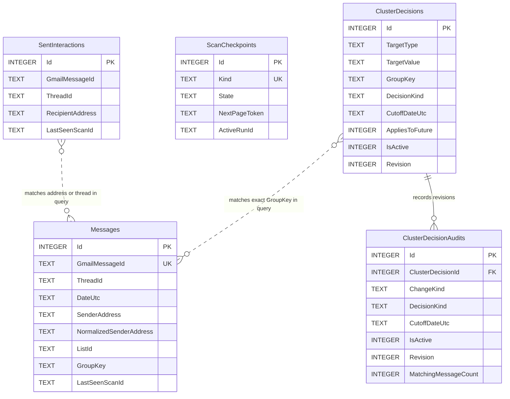

# Database schema

EF Core migration `202608190001_InitialCreate` creates the census tables. Migration `202608190002_HumanSeedDecisions` adds durable current decisions and append-only decision history. SQLite stores UTC `DateTime` values as `TEXT`, booleans as `INTEGER`, and enum values as readable strings.

The relationship is derived, not a foreign key: Gmail threads can span multiple messages, and an address interaction can relate to many messages.

## `Messages`

| Column | Null | Notes |
| --- | --- | --- |
| `Id` | No | Integer primary key, autoincrement |
| `GmailMessageId` | No | Immutable Gmail ID; unique index |
| `ThreadId` | No | Gmail thread ID; indexed |
| `DateUtc` | No | Gmail internal date in UTC; indexed |
| `LabelIdsJson` | No | Sorted label ID array; no message content |
| `SenderName` | Yes | Parsed display name |
| `SenderAddress` | No | Parsed original sender address |
| `NormalizedSenderAddress` | No | Trimmed lowercase sender address |
| `ReplyToAddress` | Yes | Normalized Reply-To address |
| `Subject` | No | Selected metadata header, max 998 characters |
| `ListId` | Yes | Normalized List-ID identifier |
| `HasListUnsubscribe` | No | Header-presence flag only; URL/value is not stored |
| `HasAttachment` | No | Derived from structure-only MIME partial response |
| `IsUnread` | No | `UNREAD` label flag |
| `IsStarred` | No | `STARRED` label flag |
| `IsImportant` | No | `IMPORTANT` label flag |
| `IsPromotion` | No | `CATEGORY_PROMOTIONS` label flag |
| `HasDirectCorrespondence` | No | Sender occurs in normalized Sent recipients |
| `HasThreadInteraction` | No | Thread occurs in Sent interaction index |
| `GroupKey` | No | `list:{id}` or `sender:{address}`; indexed |
| `GroupDisplay` | No | List identifier or sender display/address |
| `GroupKind` | No | `List-ID` or `Sender` |
| `LastSeenScanId` | No | Successful-run pruning marker |
| `IndexedAtUtc` | No | Last metadata upsert time |

## `SentInteractions`

| Column | Null | Notes |
| --- | --- | --- |
| `Id` | No | Integer primary key, autoincrement |
| `GmailMessageId` | No | Sent Gmail message ID |
| `ThreadId` | No | Gmail thread ID; indexed |
| `RecipientAddress` | No | Normalized To/Cc/Bcc recipient; indexed |
| `DateUtc` | No | Gmail internal date in UTC |
| `LastSeenScanId` | No | Successful-run pruning marker |

`(GmailMessageId, RecipientAddress)` has a unique composite index.

## `ScanCheckpoints`

| Column | Null | Notes |
| --- | --- | --- |
| `Id` | No | Integer primary key, autoincrement |
| `Kind` | No | Unique `Sent` or `Census` enum string |
| `State` | No | `NeverRun`, `Running`, `Completed`, or `Failed` |
| `NextPageToken` | Yes | Opaque Gmail page token for resume |
| `ProcessedCount` | No | Metadata records examined in active/last run |
| `StartedAtUtc` | Yes | Run start |
| `UpdatedAtUtc` | Yes | Last page/status update |
| `CompletedAtUtc` | Yes | Successful completion |
| `FailureCode` | Yes | Sanitized category; never raw exception/body/token text |
| `ActiveRunId` | Yes | Stable across retries; cleared on completion |

## `ClusterDecisions`

| Column | Null | Notes |
| --- | --- | --- |
| `Id` | No | Integer primary key, autoincrement |
| `TargetType` | No | `ListId` or `Sender` enum string |
| `TargetValue` | No | Stable normalized List-ID or sender address |
| `GroupKey` | No | Indexed `list:{id}` or `sender:{address}` reference |
| `DecisionKind` | No | Keep/protect, unwanted, existing-only, age rule, or defer |
| `CutoffDateUtc` | Yes | UTC midnight cutoff; required only for `CleanOlderThan` |
| `AppliesToFuture` | No | Explicit derived policy semantic |
| `IsActive` | No | False after removal; the row is retained for audit continuity |
| `Revision` | No | Monotonically increases on create/edit/remove |
| `CreatedAtUtc` | No | Initial decision timestamp |
| `UpdatedAtUtc` | No | Most recent revision timestamp; also bounds `CleanExistingOnly` against later mail |

`(TargetType, TargetValue)` is unique. Sender targets apply only to messages without a List-ID, matching the census fallback rule. Domain targets do not exist. Any active row marks the source reviewed; an active `Defer` row has no policy coverage. Age shortcuts are UI conveniences only—the durable rule always stores the resolved explicit `CutoffDateUtc`.

## `ClusterDecisionAudits`

| Column | Null | Notes |
| --- | --- | --- |
| `Id` | No | Integer primary key, autoincrement |
| `ClusterDecisionId` | No | Foreign key to the retained current decision row |
| `ChangeKind` | No | `Created`, `Replaced`, or `Removed` |
| `DecisionKind` | No | Decision snapshot at this revision |
| `CutoffDateUtc` | Yes | Cutoff snapshot |
| `AppliesToFuture` | No | Future-policy snapshot |
| `IsActive` | No | Active-state snapshot |
| `Revision` | No | Unique per decision with `ClusterDecisionId` |
| `MatchingMessageCount` | No | Current exact-cluster size when the change was made |
| `ChangedAtUtc` | No | Revision timestamp |

## Deliberately absent

There are no columns for body text, HTML, snippets, raw MIME, attachment bytes, unsubscribe values, OAuth access/refresh tokens, or client secrets.
